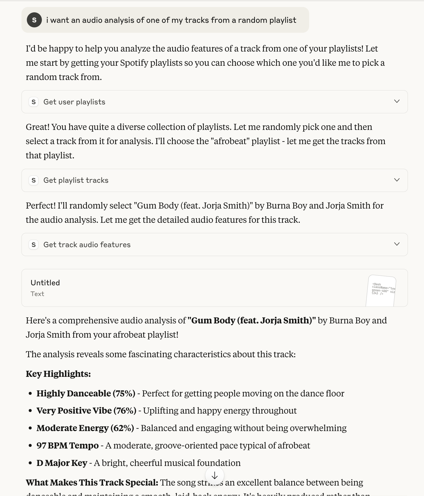

# Spotify MCP Server

An Model Context Protocol (MCP) server, enabling Claude Desktop as the MCP Client to interact with the Spotify and Reccobeats API.



## Prerequisites

Ensure the following are installed:

- [Node.js](https://nodejs.org/en/download/) (v22/LTS recommended)

## Installation

1. Clone the repository:

   ```bash
   git clone https://github.com/your-username/spotify-mcp.git
   cd spotify-mcp
   ```

2. Install the dependencies:

   ```bash
   npm install
   ```

## Configuration

This server requires Spotify API credentials and a refresh token to function. Follow these steps to set up your `.env` file:

1.  **Create a Spotify Developer Application:**
    - Go to the [Spotify Developer Dashboard](https://developer.spotify.com/dashboard/applications).
    - Log in with your Spotify account.
    - Click on "Create an app".
    - Fill in the details (App name, App description) and agree to the terms.
    - Once created, you will see your `Client ID` and `Client Secret`.

2.  **Set up Redirect URI:**
    - In your Spotify application dashboard, click "Edit Settings".
    - Under "Redirect URIs", add `http://localhost:4567/callback`.
    - Save the changes.

3.  **Get a Spotify Refresh Token:**
    - Run the server (as described in "Running the Server" below).
    - Open your web browser and navigate to `http://localhost:4567/login`.
    - You will be redirected to Spotify to authorize the application. Log in if prompted.
    - After authorization, you will be redirected back to `http://localhost:4567/callback`. Check your server's console output for your `Refresh Token`.

4.  **Create a `.env` file:**
    - In the root directory of your `spotify-mcp` project, create a file named `.env`.
    - Add the following lines to the `.env` file, replacing the placeholders with your actual credentials and refresh token:

    ```env
    SPOTIFY_CLIENT_ID=your_spotify_client_id
    SPOTIFY_CLIENT_SECRET=your_spotify_client_secret
    SPOTIFY_REFRESH_TOKEN=your_spotify_refresh_token
    ```

## Running the Server

1.  Build the TypeScript project:

    ```bash
    npm run build
    ```

2.  Start the server:

    ```bash
    node build/server.js
    ```

    The server will start and listen on `http://localhost:4567`. If `SPOTIFY_REFRESH_TOKEN` is not set in your `.env` file, it will also start an OAuth server for one-time authentication.

## Usage with Claude Desktop

To connect this MCP server to Claude Desktop:

1.  Open Claude Desktop.
2.  Go to Settings.
3.  Navigate to the "Model Context Protocol" section.
4.  Add a new server and configure it to point to your running Spotify MCP server (e.g., `http://localhost:4567`).
5.  Ensure the server is enabled in Claude Desktop.

Once connected, you can prompt Claude to use the available Spotify tools.

## Tool Definitions

This server exposes the following tools:

-   **`get_user_playlists`**
    -   **Description:** Gets a list of the user's Spotify playlists.
    -   **Input:**
        -   `page` (optional, number): The page number to retrieve (defaults to 1).
        -   `per_page` (optional, number): The number of playlists per page (defaults to 15).
    -   **Output:** A JSON string representing an array of playlist objects, each with `id` and `name`.

-   **`get_playlist_tracks`**
    -   **Description:** Gets a paginated list of tracks from a user's specific playlist by name.
    -   **Input:**
        -   `playlist_name` (string, required): The name of the playlist.
        -   `page` (optional, number): The page number to retrieve (defaults to 1).
        -   `per_page` (optional, number): The number of tracks per page (defaults to 15).
    -   **Output:** A JSON string representing an array of track objects, each with `id`, `name`, and `artist`.

-   **`get_track_audio_features`**
    -   **Description:** Gets the audio features for a single track, given its unique ID.
    -   **Input:**
        -   `track_id` (string, required): The unique Spotify ID of the track.
    -   **Output:** A JSON object containing the audio features for the specified track.

## Troubleshooting

-   **Server not starting or `EPIPE` errors:**
    -   Ensure no other process is using port `4567`.
    -   Check your `.env` file for correct Spotify credentials.

-   **`/login` route not working:**
    -   If `SPOTIFY_REFRESH_TOKEN` is already set in your `.env` file, the OAuth server (including `/login`) will not start automatically. Unset the variable and restart the server to re-authenticate.
