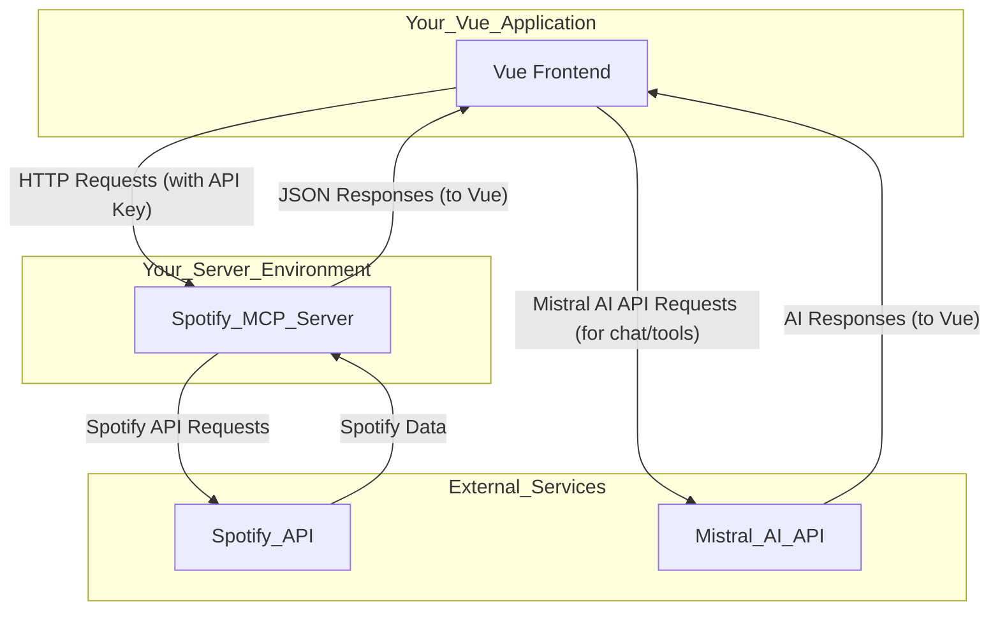

```mermaid
graph TD
    subgraph Your_Vue_Application
        A[Vue Frontend]
    end

    subgraph Your_Server_Environment
        B[Spotify_MCP_Server]
    end

    subgraph External_Services
        C[Spotify_API]
        D[Mistral_AI_API]
    end

    A -- HTTP Requests (with API Key) --> B
    A -- Mistral AI API Requests (for chat/tools) --> D
    B -- Spotify API Requests --> C
    C -- Spotify Data --> B
    D -- AI Responses (to Vue) --> A
    B -- JSON Responses (to Vue) --> A
```
